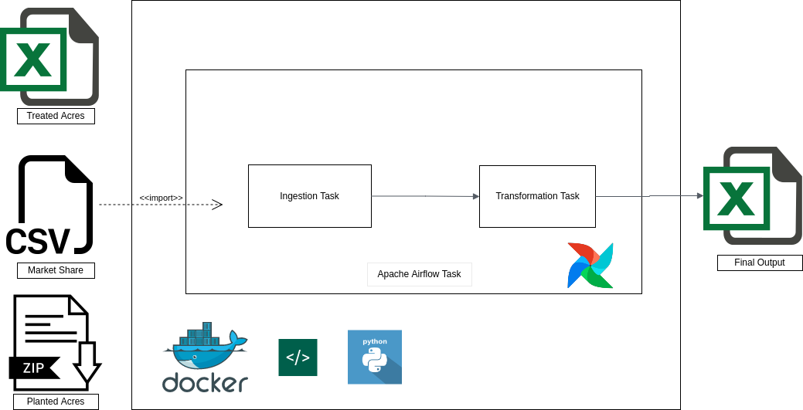
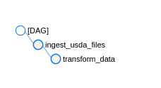
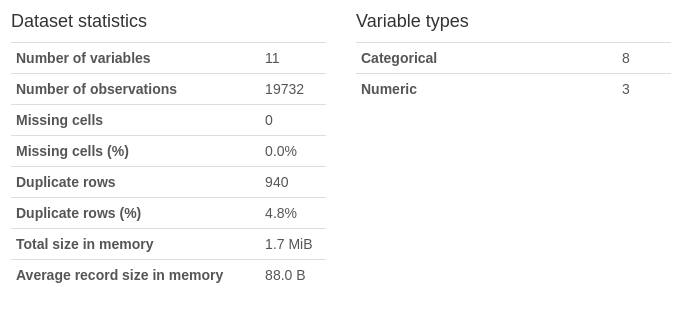

# Crops-Data-Ingestion

## Objective

The main objective of this project is to produce an output excel file based on 3 crop-related input files:

- Crop Protection Market Size (Market Size.xlsx)
- Crop Protection Treated Acres (Treated Acres.csv)
- USDA Planted Acres (an excel file extracted from zip: [link to USDA website](https://www.fsa.usda.gov/news-room/efoia/electronic-reading-room/frequently-requested-information/crop-acreage-data/index)

Given that the 3 source file data occur at different levels of granularity, the data will be aggregated and summarized when loading to the output file. This data can be used by BI teams for reporting on key metrics to the business.

## Tools

The tools used to complete this project are:
- Python (pandas, numpy, profiler etc. see requirements.txt file)
- Docker/Docker-Compose
- Apache Airflow
- Unix bash commands
- Jupyter Notebook

The architecture diagram shows the process in more detail:

## Process Flows

### Task Execution & Scheduling

Apache Airflow was used to divide the tasks into data ingestion & transformation.

#### Alerts

The DAG has been setup to alert when a task fails, or if a task SLA takes longer exceeds a 10 minute runtime.

### Logging

All python files implement the standard logger library for monitoring row counts and errors. Output log files are also generated.

### Data Quality Monitoring

The Pandas Profiling module was used to calculate basig data metrics such as missing values & duplicates in source files. Pandas Profiling integrates with Great Expectations (https://github.com/ydataai/pandas-profiling).

Link to profiling notebook: (https://nbviewer.org/github/vijay-ss/Crops-Data-Ingestion/blob/main/data-quality-monitoring/Data_Quality_Monitoring.ipynb)

Of note, the Market Size data set includes 940 duplicate rows at 4.8%. This is rather high and I would report these to the business and source data team.

### Unit Testing

Functions have been tested using the pytest module.
