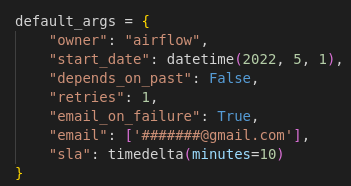
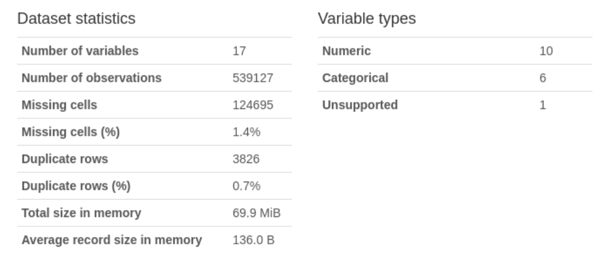

# Crops-Data-Pipeline

***to run this project locally:***

Clone the repository and run:
- docker-compose build
- docker-compose up airflow-init
- docker-compose up

## Objective

The main objective of this project is to produce an output excel file based on 3 crop-related input files:

- Crop Protection Market Size (Market Size.xlsx)
- Crop Protection Treated Acres (Treated Acres.csv)
- USDA Planted Acres (an excel file extracted from zip: [link to USDA website](https://www.fsa.usda.gov/news-room/efoia/electronic-reading-room/frequently-requested-information/crop-acreage-data/index)

### Final Data Set

Given that the 3 source file data occur at different levels of granularity, the data is aggregated and summarized at the Year and Region level before loading to the output file. Data from both sources has been pivoted into new columns, making it a wide-table. This allows for joins to occur between all 3 data sets on a common level of granularity.

This data can be used by BI teams for reporting on key metrics to the business.

## Tools

The tools used to complete this project are:
- Python (pandas, numpy, profiler, logging etc. see requirements.txt file)
- Docker/Docker-Compose
- Apache Airflow
- Unix bash commands
- Jupyter Notebook

## Architecture

The architecture diagram shows the process overview:

## Process Flows

### Task Execution & Scheduling

Apache Airflow was used to divide the tasks into data ingestion & transformation.

#### Alerts

The DAG has been setup to alert when a task fails, or if a task SLA exceeds a 10 minute runtime.

### Logging

All python files implement the standard logger library for monitoring row counts and errors. Output log files are also generated.

### Data Quality Monitoring

The Pandas Profiling module was used to calculate basic data metrics such as missing values & duplicates in source files. Pandas Profiling integrates with Great Expectations (https://github.com/ydataai/pandas-profiling).

Link to profiling notebook: (https://nbviewer.org/github/vijay-ss/Crops-Data-Ingestion/blob/main/data-quality-monitoring/Data_Quality_Monitoring.ipynb)

#### Market Size Data Quality Check

Of note, the **Market Size** data set includes 940 duplicate rows at 4.8%. This is rather high and I would report these to the business and source data team. See below:

#### Planted Acres Data Quality Check

Similarly, the **Planted Acres** data set has 0.7% duplicate rows and also 1.4% missing cells. These missing cells are localized to the crop_type column which is not used to build the final data set. See below:

### Testing

Functions have been tested using the pytest module. End-to-end testing has been completed to ensure pipeline executes without errors.

### Next Steps

- Refactor and further simplify the code
- Create separate folders for DAGs, log files and python scripts
- Split transform DAG into multiple steps
- Upload final output into a SQL database
